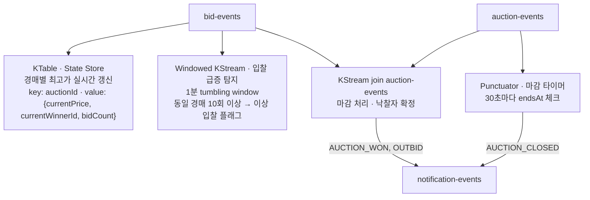
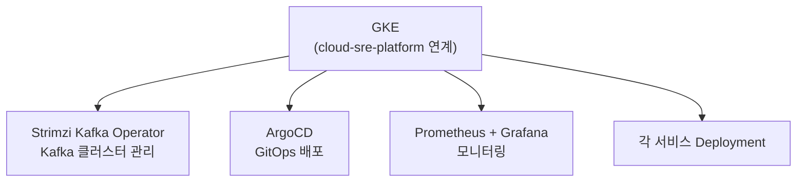

# Architecture

## 개요

realtime-auction-service는 Kafka Streams 기반 실시간 경매 서비스입니다.
MSA 구조로 서비스를 분리하고, Debezium CDC + Outbox Pattern으로 이벤트 유실 없는 발행을 보장합니다.
Kafka Streams State Store로 실시간 최고가를 관리하고, WebSocket으로 클라이언트에 실시간 알림을 전달합니다.

---

## 전체 아키텍처

전체 아키텍처 개요는 [README.md](../README.md#architecture)를 참고합니다.

---

## 서비스 구성

| 서비스 | 역할 | Port | DB |
|--------|------|------|----|
| API Gateway | 라우팅, JWT 1차 방어 (만료·위조 차단, Authorization 헤더 전달) | 8080 | - |
| Auction Service | 경매 CRUD, Outbox 발행, OAuth2 Resource Server JWT 검증 | 8081 | PostgreSQL |
| Bid Service | 입찰 처리, 유효성 검증, OAuth2 Resource Server JWT 검증 | 8082 | PostgreSQL |
| User Service | 회원가입/로그인, JWT 발급, JWKS 노출 (/.well-known/jwks.json) | 8083 | PostgreSQL |
| Notification Service | Kafka 소비 → WebSocket push | 8084 | - |
| Schema Registry | Avro 스키마·버전 관리. **로컬(docker-compose)**: 호스트에서 접속할 때 `localhost:8085` — 정의·출처는 `infra/.env.example`의 `SCHEMA_REGISTRY_PORT`, [local-dev.md](./local-dev.md) 「접속 정보」 표. 컨테이너·브릿지 네트워크 안에서는 `http://schema-registry:8081` 등 **다른 포트**를 쓴다. | 8085 | - |
| Auction Streams | 실시간 집계, 마감 처리, Interactive Query REST | 8086 | State Store (RocksDB) |

> **포트 구분**: `8085`는 표의 Schema Registry 행 출처와 같다. `8086`은 Auction Streams HTTP(`AUCTION_STREAMS_PORT`, `streams/auction-streams/application.yml`). 운영 환경에서는 번호가 다를 수 있다.
> **Interactive Query 주소 규칙**: 멀티 인스턴스/운영 환경에서는 `KAFKA_STREAMS_APPLICATION_SERVER`에 인스턴스 간 접근 가능한 주소(`host:port`)를 반드시 주입한다. `localhost`는 `local` 프로필 단일 실행에서만 사용한다.

---

## 경매 생명주기와 마감 정책

이 프로젝트에서 **“경매가 끝났다”를 데이터로 표현할 때** 다음을 구분한다.

### 진실의 원본(source of truth)

- **`auctions.status`(PostgreSQL, Auction Service)**  
  목록·필터·운영 화면 등 **도메인 상태**의 기준. 특히 **`CLOSED`는 Auction Service DB가 책임**진다.
- **`endsAt`**  
  비즈니스상 입찰 가능 마감 시각. DB 컬럼으로 저장하며 비교 시 **UTC 기준**으로 통일한다.

### 시간 경과에 따른 마감(`ONGOING` → `CLOSED`)

- **Auction Service 스케줄러**가 주기적으로 **`endsAt`이 지난 `ONGOING` 경매를 `CLOSED`로 갱신**하고, 필요 시 **`AUCTION_STATUS_CHANGED` Outbox**까지 기록한다.
- 스케줄 주기는 부하와 허용 지연의 트레이드오프다. 이 레포는 **실시간 집계가 주 목적**이므로 **분 단위 배치(예: 1분)** 를 기본으로 하고, 더 촘촘히 맞추려면 **10~30초** 등으로 조정한다. **매초 폴링**까지는 일반적으로 필요하지 않다.
- 스케줄러가 다음 배치까지 **짧은 지연**이 있을 수 있으므로, **입찰 수락 여부는 DB `CLOSED`만 보지 않는다.**

### 입찰 검증(Bid Service)

- 유효 입찰은 **경매가 진행 중(`ONGOING` 등)이면서**, 요청 시각 기준 **`endsAt` 이전**이어야 한다.  
  즉 **마감 시각은 `endsAt` 비교가 1차 방어선**, DB `CLOSED`는 **조회·일관성용으로 뒤따라 반영**된다.

### 조기 종료

- 판매자·내부 시스템이 **`PATCH /auctions/{id}/status` 등으로 `CLOSED`로 바꾸는 경우**는 **명시적 전이**로 처리한다(스케줄러와 별개).

### Kafka / Kafka Streams와의 역할 분담

- **Kafka Streams(Punctuator 등)** 가 발행하는 **`AUCTION_CLOSED`·`notification-events` 상 마감 알림**은 **실시간 처리·알림·구독자 푸시** 목적이다. **Auction Service DB의 `CLOSED`를 대체하는 진실 원본이 아니다.**
- Streams의 마감 감지는 stream time 등 운영 특성상 **알림 시점이 DB 갱신과 수 초~수십 초 어긋날 수 있다**고 가정한다. **목록·입찰 정책은 위 Auction/Bid 규칙을 따른다.**

상세 이벤트 스키마는 [kafka.md](./kafka.md)를 참고한다.

서비스 코드 관점에서 역할만 표로 보려면 [services/CLAUDE.md](../services/CLAUDE.md) 「경매 마감·상태 책임」.

---

## 핵심 기술 결정

각 결정의 상세 근거·고려한 대안은 [adr/](adr/README.md) 참고.

| # | 결정 | 한 줄 요약 | ADR |
|---|------|-----------|-----|
| 1 | Outbox Pattern + Debezium CDC | DB 트랜잭션과 Kafka 발행을 원자적으로 처리하여 이벤트 유실 방지 | [ADR-001](adr/001-outbox-pattern-debezium.md) |
| 2 | Kafka Streams State Store | 동시 입찰 DB 경합 없이 실시간 최고가를 State Store에서 관리 | [ADR-002](adr/002-kafka-streams-state-store.md) |
| 3 | Redis 기반 WebSocket 세션 공유 | 멀티 인스턴스 스케일아웃 시 세션 정보를 Redis로 공유 | [ADR-003](adr/003-redis-websocket-session.md) |
| 4 | Avro + Schema Registry | Kafka 이벤트 스키마 버전을 중앙 관리하여 하위 호환성 보장 | [ADR-004](adr/004-avro-schema-registry.md) |
| 5 | Resilience4j Circuit Breaker | 서비스 간 REST 호출 장애를 빠르게 차단하여 장애 전파 방지 | [ADR-005](adr/005-resilience4j-circuit-breaker.md) |
| 6 | OAuth2 Resource Server (Zero Trust JWT 검증) | Gateway 1차 방어 + 각 서비스 독립 JWT 검증으로 Gateway 우회 공격 방어 | [ADR-006](adr/006-oauth2-resource-server-zero-trust.md) |

---

## Kafka Streams 처리 흐름

---

## 인프라 구성

로컬 개발은 `docker-compose.yml`로 전체 인프라를 로컬에서 구동합니다.
운영 배포는 GKE 위에서 ArgoCD GitOps로 관리합니다.
