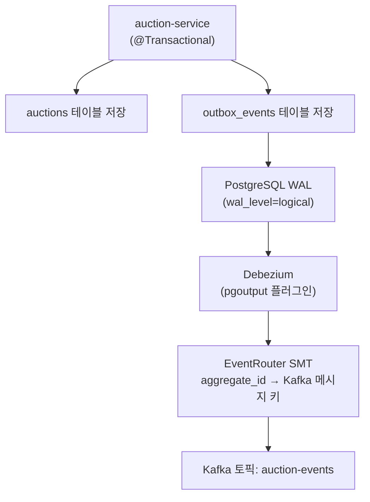

# Debezium Connector 가이드

Kafka Connect(Debezium)는 PostgreSQL의 WAL(Write-Ahead Log)을 읽어 `outbox_events` 테이블의
변경을 Kafka 토픽으로 자동 발행합니다. 이 가이드는 로컬 개발 환경 기준입니다.

> [!IMPORTANT]
> Connector 등록은 최초 1회만 필요합니다.
> Debezium은 Kafka 내부 토픽에 진행 상태(offset)를 저장하므로, 컨테이너를 재시작해도 등록이 유지됩니다.

---

## 동작 원리



- `outbox_events` 테이블에 INSERT가 발생하면 Debezium이 WAL에서 감지합니다.
- **EventRouter SMT**가 `aggregate_id` 컬럼을 Kafka 메시지 키로, `payload` 컬럼을 메시지 값으로 변환합니다.
- 최종 목적지 토픽은 `auction-events`입니다.

---

## 파일 구성

| 파일 | 역할 |
|------|------|
| `infra/debezium/connectors/auction-outbox-connector.json` | Connector 설정 템플릿 (환경별 값은 스크립트에서 주입) |
| `infra/debezium/connectors/bid-outbox-connector.json` | Bid용 Connector 설정 템플릿 (환경별 값은 스크립트에서 주입) |
| `infra/debezium/register-connectors.sh` | 비밀번호·Schema Registry URL을 주입하고 등록/삭제를 수행하는 스크립트 |

---

## 사전 조건

1. `infra/.env`에 `DEBEZIUM_PASSWORD`, `SCHEMA_REGISTRY_URL` 설정
2. `docker-compose up -d` 로 인프라 전체 기동 (debezium 컨테이너가 healthy 상태인지 확인)
3. `jq` 설치 (`brew install jq` 또는 `apt install jq`)

---

## 등록 절차

```bash
# 1. Debezium 컨테이너 상태 확인
curl http://localhost:8083/connectors

# 2. 스크립트 실행 (infra/debezium 디렉토리에서)
cd infra/debezium
./register-connectors.sh

# 3. 기존 커넥터를 먼저 지우고 재등록하려면
./register-connectors.sh --recreate
```

스크립트는 `infra/.env`를 읽어 `DEBEZIUM_PASSWORD`, `SCHEMA_REGISTRY_URL`을 JSON 요청 본문에 동적으로 주입합니다.
템플릿 JSON에는 환경별 URL/비밀번호를 저장하지 않으므로 저장소 노출 위험과 환경별 파일 분기를 줄일 수 있습니다.

---

## Connector 관리 명령

```bash
# 삭제 후 재등록
cd infra/debezium
./register-connectors.sh --recreate

# 삭제만 수행
./register-connectors.sh --delete-only

# 등록된 Connector 목록
curl http://localhost:8083/connectors

# 상태 확인
curl http://localhost:8083/connectors/auction-outbox-connector/status

# 재시작 (일시적 오류 복구 시)
curl -X POST http://localhost:8083/connectors/auction-outbox-connector/restart

# 삭제 (재등록이 필요할 때)
curl -X DELETE http://localhost:8083/connectors/auction-outbox-connector
```

---

## 설정 주요 항목 설명

| 설정 키 | 값 | 의미 |
|---------|----|------|
| `database.hostname` | `postgres-auction` | Docker 내부 호스트명 (docker-compose 서비스명) |
| `database.user` | `debezium` | 복제 전용 계정 (`init-scripts/auction-db/` 에서 생성) |
| `table.include.list` | `public.outbox_events` | CDC 대상 테이블만 한정 (auctions 테이블 제외) |
| `publication.autocreate.mode` | `disabled` | init 스크립트에서 이미 `debezium_publication` 생성했으므로 Connector가 재생성하지 않도록 설정 |
| `publication.name` | `debezium_publication` | init 스크립트가 만든 publication 이름과 일치해야 함 |
| `transforms.outbox.type` | `EventRouter` | Outbox 패턴 전용 SMT. payload 를 꺼내 토픽으로 라우팅 |
| `transforms.outbox.table.field.event.key` | `aggregate_id` | Kafka 메시지 키로 쓸 컬럼 (`outbox_events.aggregate_id`) |
| `transforms.outbox.route.topic.replacement` | `auction-events` | 최종 Kafka 토픽 이름 |
| `key.converter` | `StringConverter` | `aggregate_id`를 문자열 키로 발행 |
| `value.converter` | `AvroConverter` | Outbox payload를 Avro로 직렬화하여 발행 |
| `value.converter.schema.registry.url` | `${SCHEMA_REGISTRY_URL}` | 스크립트가 요청 시점에 주입 |
| `transforms.outbox.table.expand.json.payload` | `true` | JSON 문자열 payload를 필드 구조로 펼쳐 Avro 직렬화 가능하게 처리 |

---

## 자주 발생하는 오류

| 증상 | 원인 | 해결 |
|------|------|------|
| `409 Conflict` | 같은 이름의 Connector가 이미 등록됨 | `DELETE` 후 재등록 |
| `publication does not exist` | `debezium_publication` 이 DB에 없음 | DB를 초기화(`docker-compose down -v`) 후 재시작 |
| `replication slot already exists` | `debezium_auction_outbox` slot이 남아 있음 | `SELECT pg_drop_replication_slot('debezium_auction_outbox');` 실행 후 재등록 |
| `DEBEZIUM_PASSWORD is required` | `.env` 에 비밀번호 미설정 | `infra/.env` 에 `DEBEZIUM_PASSWORD` 값 확인 |
| `schema.registry.url ...` 직렬화 오류 | Registry URL 오설정/미설정 | `infra/.env`의 `SCHEMA_REGISTRY_URL` 확인 후 `--recreate` |
