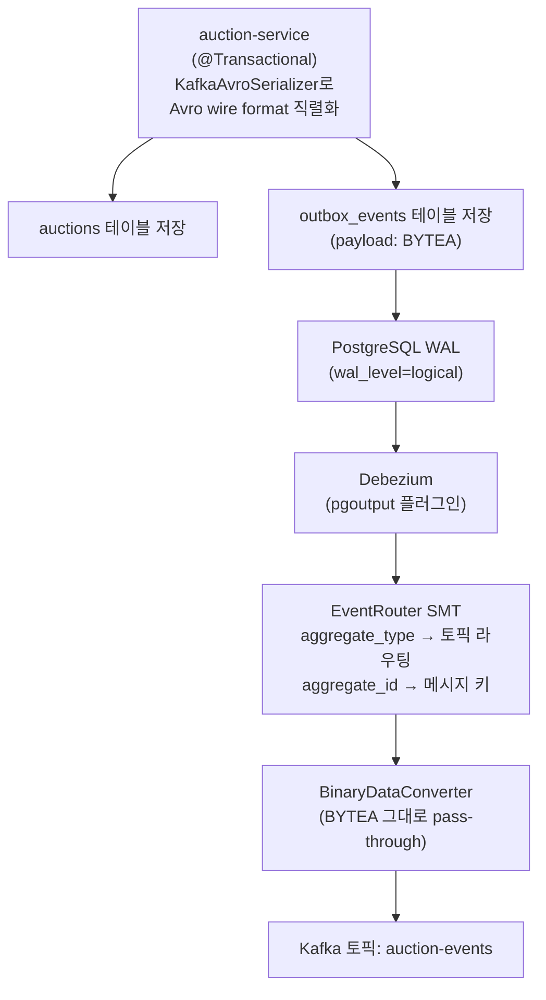

# Debezium Connector 가이드

Kafka Connect(Debezium)는 PostgreSQL의 WAL(Write-Ahead Log)을 읽어 `outbox_events` 테이블의
변경을 Kafka 토픽으로 자동 발행합니다. 이 가이드는 로컬 개발 환경 기준입니다.

> [!IMPORTANT]
> Connector 등록은 최초 1회만 필요합니다.
> Debezium은 Kafka 내부 토픽에 진행 상태(offset)를 저장하므로, 컨테이너를 재시작해도 등록이 유지됩니다.

> [!NOTE]
> **설정 변경 시:** 등록된 커넥터가 이미 존재하면 Job이 skip됩니다. 설정을 바꿀 때는 기존 커넥터를 `DELETE`한 뒤 재등록해야 합니다.

---

## 동작 원리


```mermaid
graph TD
    AS["auction-service<br/>(@Transactional)<br/>KafkaAvroSerializer로<br/>Avro wire format 직렬화"]
    AT["auctions 테이블 저장"]
    OT["outbox_events 테이블 저장<br/>(payload: BYTEA)"]
    WAL["PostgreSQL WAL<br/>(wal_level=logical)"]
    DEB["Debezium<br/>(pgoutput 플러그인)"]
    SMT["EventRouter SMT<br/>aggregate_type → 토픽 라우팅<br/>aggregate_id → 메시지 키"]
    CONV["BinaryDataConverter<br/>(BYTEA 그대로 pass-through)"]
    KAFKA["Kafka 토픽: auction-events"]

    AS --> AT
    AS --> OT
    OT --> WAL
    WAL --> DEB
    DEB --> SMT
    SMT --> CONV
    CONV --> KAFKA
```

- `outbox_events` 테이블에 INSERT가 발생하면 Debezium이 WAL에서 감지합니다.
- **EventRouter SMT**가 `aggregate_type` 컬럼으로 토픽을 결정하고, `aggregate_id`를 Kafka 메시지 키로 사용합니다.
- **BinaryDataConverter**는 `payload` BYTEA를 그대로 통과시킵니다. Avro 직렬화는 애플리케이션이 이미 수행했습니다.
- Avro 직렬화 책임 분리 결정 배경은 [ADR-008](adr/008-outbox-avro-serialization-owner.md) 참고.

---

## 파일 구성

| 파일 | 역할 |
|------|------|
| `infra/debezium/connectors/auction-outbox-connector.json` | Auction용 Connector 설정 |
| `infra/debezium/connectors/bid-outbox-connector.json` | Bid용 Connector 설정 |
| `infra/debezium/register-connectors.sh` | 비밀번호를 주입하고 등록/삭제를 수행하는 스크립트 |
| `infra/k8s/base/debezium/connector-register-job.yaml` | GKE에서 최초 1회 실행되는 Kubernetes Job |

---

## 사전 조건

1. `infra/.env`에 `DEBEZIUM_PASSWORD` 설정
2. `docker-compose up -d` 로 인프라 전체 기동 (debezium 컨테이너가 healthy 상태인지 확인)
3. `jq` 설치 (`brew install jq` 또는 `apt install jq`)

> Schema Registry URL은 커넥터 설정에 포함되지 않습니다. `BinaryDataConverter`는 payload를 그대로 전달하므로 Schema Registry에 접근하지 않습니다.

---

## 등록 절차

```bash
# 1. Debezium 컨테이너 상태 확인
curl http://localhost:8083/connectors

# 2. 스크립트 실행 (infra/debezium 디렉토리에서)
cd infra/debezium
./register-connectors.sh

# 3. 기존 커넥터를 먼저 지우고 재등록하려면
./register-connectors.sh --recreate
```

스크립트는 `infra/.env`를 읽어 `DEBEZIUM_PASSWORD`를 JSON 요청 본문에 동적으로 주입합니다.

---

## Connector 관리 명령

```bash
# 삭제 후 재등록
cd infra/debezium
./register-connectors.sh --recreate

# 삭제만 수행
./register-connectors.sh --delete-only

# 등록된 Connector 목록
curl http://localhost:8083/connectors

# 상태 확인
curl http://localhost:8083/connectors/auction-outbox-connector/status

# 재시작 (일시적 오류 복구 시)
curl -X POST http://localhost:8083/connectors/auction-outbox-connector/restart

# 삭제 (재등록이 필요할 때)
curl -X DELETE http://localhost:8083/connectors/auction-outbox-connector
```

---

## 설정 주요 항목 설명

| 설정 키 | 값 | 의미 |
|---------|----|------|
| `database.hostname` | `postgres-auction` | Docker 내부 호스트명 (docker-compose 서비스명) |
| `database.user` | `debezium` | 복제 전용 계정 (`init-scripts/auction-db/` 에서 생성) |
| `table.include.list` | `public.outbox_events` | CDC 대상 테이블만 한정 (auctions 테이블 제외) |
| `publication.autocreate.mode` | `disabled` | init 스크립트에서 이미 publication 생성했으므로 Connector가 재생성하지 않도록 설정 |
| `snapshot.mode` | `never` | 초기 스냅샷 비활성화. 기존 outbox 행 재처리 방지 |
| `transforms.outbox.type` | `EventRouter` | Outbox 패턴 전용 SMT. payload를 꺼내 토픽으로 라우팅 |
| `transforms.outbox.route.by.field` | `aggregate_type` | 이 컬럼 값으로 목적지 토픽을 결정 (`AUCTION` → `auction-events`, `BID` → `bid-events`) |
| `transforms.outbox.table.field.event.key` | `aggregate_id` | Kafka 메시지 키로 쓸 컬럼 |
| `transforms.outbox.table.field.event.type` | `event_type` | 이벤트 타입 컬럼 |
| `transforms.outbox.table.field.event.payload` | `payload` | Kafka 메시지 값으로 쓸 컬럼 (BYTEA) |
| `transforms.outbox.route.topic.replacement` | `auction-events` / `bid-events` | 최종 Kafka 토픽 이름 |
| `key.converter` | `StringConverter` | `aggregate_id`를 문자열 키로 발행 |
| `value.converter` | `BinaryDataConverter` | BYTEA payload를 그대로 Kafka로 전달. Debezium이 재직렬화하지 않음 |
| `value.converter.delegate.converter.type` | `JsonConverter` | BinaryDataConverter 내부 fallback 컨버터 (실제 변환은 발생하지 않음) |

---

## 자주 발생하는 오류

> 아래 예시는 로컬 환경(docker-compose) 기준입니다. GKE 환경은 slot 이름이 다릅니다(`debezium_auction`, `debezium_bid`).

| 증상 | 원인 | 해결 |
|------|------|------|
| `409 Conflict` | 같은 이름의 Connector가 이미 등록됨 | `DELETE` 후 재등록 |
| `publication does not exist` | publication이 DB에 없음 | DB를 초기화(`docker-compose down -v`) 후 재시작 |
| `replication slot already exists` | slot이 남아 있음 | `SELECT pg_drop_replication_slot('debezium_auction_outbox');` 실행 후 재등록 |
| `DEBEZIUM_PASSWORD is required` | `.env`에 비밀번호 미설정 | `infra/.env`에 `DEBEZIUM_PASSWORD` 값 확인 |
| `insufficient privileges to start walsender` | debezium 유저 REPLICATION 권한 없음 | `ALTER USER debezium WITH REPLICATION` 실행 |
| `permission denied for table outbox_events` | debezium 유저 SELECT 권한 없음 | Flyway V9(auction)/V5(bid) 마이그레이션으로 `GRANT SELECT ON outbox_events TO debezium` 적용 확인 |

---

## GKE 운영 주의사항

| 항목 | 내용 |
|------|------|
| connector-register Job | 커넥터가 이미 존재하면 Job이 skip됩니다. 설정 변경 시 반드시 기존 커넥터 `DELETE` 후 재등록 필요 |
| debezium 유저 권한 (Cloud SQL) | `ALTER USER debezium WITH REPLICATION` + `GRANT cloudsqllogical TO debezium` 이 모두 필요합니다. `cloudsqllogical`은 Cloud SQL 전용 역할로 Terraform/init script로 코드화되어 있지 않으므로 수동 적용 후 관리 필요 |
| SCHEMA_REGISTRY_URL | 커넥터 설정에 Schema Registry URL이 포함되지 않습니다. 앱의 ConfigMap에는 여전히 필요합니다 (앱이 Avro 직렬화 시 사용) |
