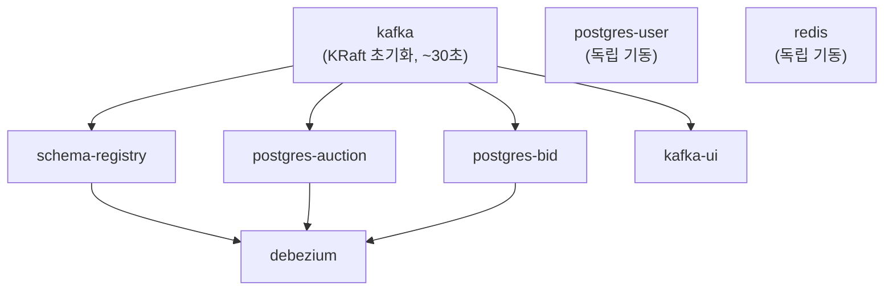

# 로컬 개발 환경 가이드

`docker-compose`를 사용한 로컬 인프라 구성 및 운영 가이드입니다.

---

## 구성 요소

| 컨테이너 | 이미지 | 용도 |
|---------|--------|------|
| kafka | confluentinc/cp-kafka:7.7.0 | 메시지 브로커 (KRaft 모드) |
| schema-registry | confluentinc/cp-schema-registry:7.7.0 | Avro 스키마 버전 관리 |
| debezium | (커스텀 빌드) | PostgreSQL CDC → Kafka 발행 |
| postgres-auction | postgres:17 | Auction Service 전용 DB |
| postgres-bid | postgres:17 | Bid Service 전용 DB |
| postgres-user | postgres:17 | User Service 전용 DB |
| redis | redis:7-alpine | WebSocket 세션 공유 |
| kafka-ui | provectuslabs/kafka-ui | 토픽/메시지 모니터링 (개발 전용) |

---

## 사전 준비

### 환경변수 파일 생성

```bash
cd infra
cp .env.example .env
```

> [!WARNING]
> `.env` 파일은 Git에 커밋되지 않습니다. 로컬에서만 관리하세요.

복사 후 아래 항목을 직접 생성하여 채워야 합니다.

- **JWT 키 쌍** — `.env.example` 내 생성 명령어 참고
- **INTERNAL_REQUEST_SECRET** — Gateway ↔ auction-service 간 내부 인증 시크릿. 자세한 내용은 [docs/internal-service-auth.md](./internal-service-auth.md) 참고

### Debezium 이미지 빌드

Debezium 컨테이너는 `confluent-hub`으로 PostgreSQL 커넥터를 설치하기 때문에 첫 실행 시 빌드가 필요합니다. 빌드 중 인터넷 연결이 필요합니다.

```bash
docker-compose build debezium
```

---

## 시작 / 종료

```bash
# 전체 인프라 기동 (백그라운드)
docker-compose up -d

# 특정 서비스만 기동 (예: Kafka + DB만)
docker-compose up -d kafka schema-registry postgres-auction postgres-bid postgres-user redis

# 전체 종료 (볼륨 유지)
docker-compose down

# 전체 종료 + 볼륨 삭제 (데이터 초기화)
docker-compose down -v
```

### 기동 순서

healthcheck 의존성에 의해 자동으로 순서가 보장됩니다.



> Debezium은 kafka + schema-registry + postgres-auction + postgres-bid 모두 healthy 상태가 된 후 기동됩니다.
> 전체 기동까지 최대 2~3분 소요될 수 있습니다.

---

## 접속 정보

| 서비스 | 호스트 (로컬 앱 → 컨테이너) | 포트 |
|--------|--------------------------|------|
| Kafka | `localhost` | `9092` |
| Schema Registry | `localhost` | `8085` |
| Debezium REST API | `localhost` | `8083` |
| PostgreSQL (auction) | `localhost` | `5432` |
| PostgreSQL (bid) | `localhost` | `5433` |
| PostgreSQL (user) | `localhost` | `5434` |
| Redis | `localhost` | `6379` |
| Kafka UI | http://localhost:9000 | `9000` |

> 컨테이너 간 내부 통신은 서비스 이름을 호스트로 사용합니다.
> 예: Debezium → Kafka는 `kafka:29092`, 서비스 → Schema Registry는 `schema-registry:8081`

---

## API 문서 (Swagger UI)

REST API 명세는 springdoc이 생성한 OpenAPI가 정본입니다. 상세 링크는 [api.md](./api.md)를 참고하세요.

### 통합 UI (권장)

api-gateway와 user / auction / bid 서비스를 기동한 뒤:

- **Swagger UI**: http://localhost:8080/swagger-ui.html
- user / auction / bid OpenAPI JSON은 Gateway가 `/user-service/v3/api-docs` 등으로 프록시

```bash
# 예: Gateway + REST 서비스 (infra/.env 로드 후)
./gradlew :services:api-gateway:bootRun
./gradlew :services:user-service:bootRun
./gradlew :services:auction-service:bootRun
./gradlew :services:bid-service:bootRun
```

### 서비스 단독 기동

| 서비스 | 포트 | Swagger UI |
|--------|------|------------|
| user-service | 8083 | http://localhost:8083/swagger-ui.html |
| auction-service | 8081 | http://localhost:8081/swagger-ui.html |
| bid-service | 8082 | http://localhost:8082/swagger-ui.html |

### 운영

`SWAGGER_ENABLED=false`로 Swagger UI·`/v3/api-docs` 노출을 끌 수 있습니다 (`infra/.env.example` 참고).

---

## Auction Streams Interactive Query 설정

`application.server`는 인스턴스 간 Interactive Query 위임 시 사용하는 "내 주소"입니다.
멀티 인스턴스에서는 반드시 다른 인스턴스가 접근 가능한 주소를 넣어야 합니다.

### 로컬 단일 실행 (권장: `local` 프로필)

- `local` 프로필에서는 `KAFKA_STREAMS_APPLICATION_SERVER`를 생략해도 `localhost:${AUCTION_STREAMS_PORT}`가 기본 적용됩니다.
- 예시:

```bash
cd streams/auction-streams
SPRING_PROFILES_ACTIVE=local ./gradlew bootRun
```

### 로컬 멀티 인스턴스 실행

- 각 인스턴스마다 서로 다른 HTTP 포트 + `KAFKA_STREAMS_APPLICATION_SERVER`를 지정해야 합니다.
- 예시:

```bash
# instance-1
SPRING_PROFILES_ACTIVE=local AUCTION_STREAMS_PORT=8086 KAFKA_STREAMS_APPLICATION_SERVER=localhost:8086 ./gradlew bootRun

# instance-2
SPRING_PROFILES_ACTIVE=local AUCTION_STREAMS_PORT=8087 KAFKA_STREAMS_APPLICATION_SERVER=localhost:8087 ./gradlew bootRun
```

### 주의사항 (local 외 프로필)

- `local`이 아닌 프로필에서는 `KAFKA_STREAMS_APPLICATION_SERVER`를 반드시 설정해야 합니다.
- `localhost`를 사용하면 인스턴스 간 위임이 깨질 수 있어 앱이 시작 단계에서 차단됩니다.

---

## Debezium Connector 등록

Debezium 컨테이너가 기동된 후 Connector를 **별도로 한 번 등록**해야 CDC 파이프라인이 시작됩니다.
Connector 설정과 등록 방법의 자세한 내용은 [docs/debezium-connector.md](./debezium-connector.md)를 참고하세요.

```bash
# 등록 스크립트 실행 (infra/.env 의 DEBEZIUM_PASSWORD 를 읽어 자동 주입)
cd infra/debezium && ./register-connectors.sh

# Connector 상태 확인
curl http://localhost:8083/connectors/auction-outbox-connector/status
```

> 이미 같은 이름의 Connector가 등록되어 있으면 POST 가 409 에러를 반환합니다.
> 재등록이 필요하면 먼저 삭제하세요.
>
> ```bash
> curl -X DELETE http://localhost:8083/connectors/auction-outbox-connector
> ```

---

## Kafka 토픽 수동 생성

`KAFKA_AUTO_CREATE_TOPICS_ENABLE=false`로 설정되어 있으므로 토픽을 명시적으로 생성해야 합니다.

```bash
# Kafka 컨테이너 내부에서 실행
docker exec -it kafka bash

# 토픽 생성
kafka-topics --bootstrap-server localhost:9092 --create --topic auction-events --partitions 3 --replication-factor 1
kafka-topics --bootstrap-server localhost:9092 --create --topic bid-events --partitions 6 --replication-factor 1
kafka-topics --bootstrap-server localhost:9092 --create --topic notification-events --partitions 3 --replication-factor 1
kafka-topics --bootstrap-server localhost:9092 --create --topic auction-dead-letter --partitions 1 --replication-factor 1
kafka-topics --bootstrap-server localhost:9092 --create --topic bid-dead-letter --partitions 1 --replication-factor 1

# 토픽 목록 확인
kafka-topics --bootstrap-server localhost:9092 --list
```

---

## Schema Registry에 Avro 스키마 등록

이벤트 계약을 Registry에 올려 두려면 `infra/avro` 스크립트를 실행합니다.
상세는 [docs/avro-schema.md](./avro-schema.md)를 참고하세요.

```bash
cd infra/avro && ./register-schemas.sh
```

---

## PostgreSQL 접속

```bash
# Auction DB
psql -h localhost -p 5432 -U appuser -d auction_db

# Bid DB
psql -h localhost -p 5433 -U appuser -d bid_db

# User DB
psql -h localhost -p 5434 -U appuser -d user_db
```

비밀번호는 `.env` 파일의 `POSTGRES_PASSWORD` 값을 사용합니다.

---

## 상태 확인

```bash
# 전체 컨테이너 상태
docker-compose ps

# 특정 컨테이너 로그
docker-compose logs -f kafka
docker-compose logs -f debezium

# 헬스체크 상태 확인
docker inspect --format='{{.State.Health.Status}}' kafka
```

---

## 데이터 초기화

볼륨을 삭제하면 모든 데이터(Kafka 메시지, DB 데이터, Redis 데이터)가 초기화됩니다.

```bash
docker-compose down -v
docker-compose up -d
```

> [!CAUTION]
> `KAFKA_CLUSTER_ID`는 볼륨 초기화 후에도 동일한 값을 유지해야 합니다.
> 값을 바꾸려면 `kafka-data` 볼륨도 반드시 함께 삭제하세요.
